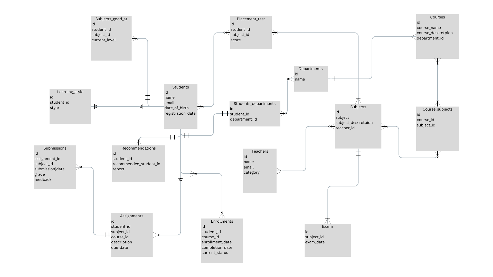

# Design Document

Abu Bakkar Siddique Awan

Video overview: <URL HERE>

## Scope

* What is the purpose of your database?
The purpose of my database is to provide a personalized learning experience for students where they can get personalized feedback and reports based on their performance, Apart from just enrolling students in a course, grading their assignments etc, the system provides an insightful feedback to students regarding their performance for an enhanced performance analysis, and some recommendations based on their placement tests.

* Which people, places, things, etc. are you including in the scope of your database?
1. Students, their placement tests, Learning styles, Recommendations based on their placement tests, departments, and courses they are enrolled in.  
2. Teachers, the subjects they teach.  
3. Deprtments, each department offers courses.  
4. Subjects, each subject is part of some course.  
5. Enrollments, to track the enrolled courses of the students.  
6. Assignments, to track the assignments of subjects.   
7. Exam, exams conducted at the end of course.  

* Which people, places, things, etc. are *outside* the scope of your database?
1. Although the database is designed very well for its core functionality, but it has a few constraints.  
2. The system is not designed cover the internal management of the institution that is using this database.  
3. The system does not include tables to track the management heirarchy, it is left upon the institution.  
4. The exams are conducted, but on a very small scale, the users of the database are welcome to alter exams functionality if they prefer a thorough examination system.  
5. A mechanism to track learning_style is created, for simplicity it is left on the teachers to track the learning styles of the students.  

## Functional Requirements
In this section you should answer the following questions:

* What should a user be able to do with your database?

1. The user(primary user is the student) will be able to register and take placement test or register for some courses, after student has enrolled their progress is monitored, regular assignments have to be submitted by the them.

2. For the placement tests, the student can take a placement test on variety of subjects to determine their best, based on this test, a report is generated that covers variety of matrices such as their average score, their best score, their best subject, and based on the results of thier placement tests departments are recommended, and the subject they scored best in is tracked as thier strongest_subject.

3. Another user of this database is the teacher, teachers can post assignments and grade submissions by the students, teachers also have the reponsibilty of tracking learning styles of the students, and update the database for each student.  

* What's beyond the scope of what a user should be able to do with your database?
1. The students and the teachers cannot track their attendance.  
2. The database has lmitations in termns of  facilitating robust collaboration tools among students or between students and teachers, such as group projects or shared documents.  
3. The user interface and experience (UI/UX) may not be optimized for easy navigation and accessibility, potentially impacting user satisfaction and adoption.  

## Representation

### Entities

In this section you should answer the following questions:

* Which entities will you choose to represent in your database?
1.  Students
2.  Teachers
3.  Departments 
4.  Courses
5.  Subjects
6.  Placement tests
7.  Assignments
8.  Exams
9.  Learning styles
10. Recommendations  
11. Enrollments 

* What attributes will those entities have?
* Students  
  * id
  * name
  * email
  * date_of_birth
  * registration_date  

* Teachers
  * id
  * name
  * email
  * category

* Departments 
  * id
  * name

* Courses
  * id
  * course_name
  * course_description
  * department_id

* Subjects
  * id
  * subject
  * subject_description
  * teacher_id

* Placement_tests
  * id
  * student_id
  * subject_id
  * score

* Assignments
  * id
  * student_id
  * subject_id
  * course_id
  * description
  * due_date

* Exams
  * id
  * subject_id
  * exam_date
  
* Learning Styles
  * id
  * student_id
  * learning_style

* Recommendations  
  * id
  * student_id
  * recommended_department_id
  * report

* Enrollments 
  * id
  * student_id
  * course_id
  * enrollment_date
  * completion_date
  * current_status

* Why did you choose the types you did?  
  1. Primary keys are represented by an __UNSIGNED SMALLINT__, 
  in this range 65535 different records can be represented, this is the scale for which the database is designed for aswell, this parameter can be changed, it's up to the user.  
  2. Another notable type used is the __ENUM__ (enumeration) data type that restricts the data that can be added to the particular column.
  3. For detailed reportings __TEXT__ type is used to allocate sufficient space for detail reporting.  
  4. __DATETIME__ for accurate timings, used for due dates(assignments) etc.  
  5. __DATE__ for date_of_birth where specific hours may not be necessery.  
 
* Why did you choose the constraints you did?
 1. __NOT NULL__ constraint is used on various columns to make sure no column of significance is left empty.  
 2. Although __ENUM__ is a data type but it also adds a restriction or a _constraint_ on the column.  
 3.  __PRIMARY KEY__ constraints to represent a record in each table
 4. __FOREIGN KEY__ constraints to extablish relationship between tables.  

### Relationships
In this section you should include your entity relationship diagram and describe the relationships between the entities in your database.  

## Optimizations
In this section you should answer the following questions:

* Which optimizations (e.g., indexes, views) did you create? Why?  
 ### Indexes
 Indexes have been created on the following columns after careful analysis to mentain a balance between time and space complexities.  
1. `email` (in the `Students` table)
2. `department_id` (in the `Students` table)
3. `name` (in the `Departments` table)
4. `email` (in the `Teachers` table)
5. `teacher_id` (in the `Subjects` table)
6. `department_id` (in the `Courses` table)
7. `student_id` (in the `Learning_styles` table)
8. `student_id` (in the `Placement_tests` table)
9. `subject_id` (in the `Placement_tests` table)
10. `student_id` (in the `Recommendations` table)
11. `recommended_department_id` (in the `Recommendations` table)
12. `student_id` (in the `Subjects_good_at` table)
13. `subject_id` (in the `Subjects_good_at` table)
14. `course_id` (in the `Course_Subjects` table)
15. `subject_id` (in the `Course_Subjects` table)
16. `student_id` (in the `Enrollments` table)
17. `course_id` (in the `Enrollments` table)
18. `student_id` (in the `Assignments` table)
19. `subject_id` (in the `Assignments` table)
20. `course_id` (in the `Assignments` table)
21. `assignment_id` (in the `Submissions` table)
22. `student_id` (in the `Submissions` table)
23. `subject_id` (in the `Exams` table)

## Limitations
In this section you should answer the following questions:

* What are the limitations of your design?  
1. The design has does not support attendancce system.  
2. It does not offer thorough testings to determine students learning style, instead it has left this to the teacher. 
3. The design supports around 65000 users, which is sufficient enough for a it's purpose, but at times it may not be able to work with a larger institute.
* What might your database not be able to represent very well?
The design may not be suffucient for detailed management of the institutes functionality.